# Análisis exploratorio del conjunto RSNA 2022 Cervical Spine Fracture Detection

**Proyecto 2 — Reto 20**
CC3084 · Data Science · Universidad del Valle de Guatemala · Semestre II 2026

| | |
|---|---|
| Conjunto de datos | [RSNA 2022 Cervical Spine Fracture Detection](https://www.kaggle.com/competitions/rsna-2022-cervical-spine-fracture-detection) |
| Alcance | Análisis exploratorio. No se entrena ningún modelo. |
| Repositorio | *(enlace al repositorio GitHub)* |

---

> **Nota de coordinación.** Las secciones 1 a 3 corresponden al miembro A (marco
> conceptual). Las secciones 4 a 6 corresponden al miembro D y se apoyan en los
> resultados producidos por B (notebooks 01 y 02) y C (notebooks 03 y 04).

---

## 1. Situación problemática

*(Sección a cargo del miembro A. Debe desarrollar, con la bibliografía semilla ya
verificada: qué es una fractura cervical, su incidencia y mecanismos de lesión; las
consecuencias del diagnóstico tardío; por qué la TC desplazó a la radiografía simple en
adultos; por qué la interpretación es difícil en población mayor con enfermedad
degenerativa y osteoporosis; y el argumento de generalización —los modelos previos se
entrenaron con representación geográfica limitada y fallaron en datos externos—, que es
el vacío que este conjunto multinacional busca llenar.)*

## 2. Problema científico

*(Sección a cargo del miembro A. Enunciado preciso, en forma de pregunta.)*

## 3. Objetivos

*(Sección a cargo del miembro A. Un objetivo general y al menos tres específicos,
medibles y alcanzables dentro de un análisis exploratorio: sin objetivos de modelado,
porque este proyecto no entrena modelos.)*

---

## 4. Descripción de los datos

### 4.1 Naturaleza del conjunto: son tomografías, no radiografías

La guía del curso describe el reto como un conjunto de "radiografías". **La descripción
es incorrecta y la corrección no es un detalle terminológico**, porque cambia la unidad
de análisis del proyecto.

El conjunto está formado por **tomografías computarizadas (TC) axiales** almacenadas en
formato DICOM. Una radiografía es una proyección bidimensional única. Aquí, en cambio,
cada paciente es un **volumen tridimensional** reconstruido a partir de cientos de
cortes axiales: la mediana observada es de **314 cortes por estudio**, con un rango de
**69 a 1 082**. El conjunto de entrenamiento completo suma aproximadamente 700 000
archivos DICOM y unos 350 GB.

Las consecuencias metodológicas son tres:

1. **La observación es el estudio, no la imagen.** Las 2 019 filas de `train.csv` son
   volúmenes; los 700 000 archivos `.dcm` son cortes dentro de esos volúmenes. Confundir
   ambos niveles inflaría artificialmente el tamaño muestral y filtraría información
   entre particiones (cortes del mismo paciente en *train* y en *test*).
2. **El análisis no puede hacerse en memoria local.** Todo el trabajo se ejecutó en
   Kaggle Notebooks, donde el conjunto se monta como sistema de archivos de solo
   lectura, y la lectura de metadatos se limitó a cabeceras (`stop_before_pixels=True`).
3. **La evidencia diagnóstica es tridimensional.** Como muestra la sección 5.4, una
   fractura suele ser invisible en un corte aislado y solo se aprecia al recorrer el eje
   craneocaudal o al reconstruir el plano sagital.

El criterio de inclusión oficial del conjunto fue TC axial **sin contraste con cortes
finos**, excluyendo a pacientes con cirugía previa por los artefactos metálicos y la
anatomía alterada. Los estudios provienen de **12 instituciones en 9 países de 6
continentes**, lo que explica buena parte de la heterogeneidad descrita en la sección 5.2.

### 4.2 Estructura de los archivos

```
rsna-2022-cervical-spine-fracture-detection/
├── train.csv                 # 2 019 filas × 9 columnas — etiquetas por estudio
├── test.csv                  # conjunto de prueba público (mínimo)
├── train_bounding_boxes.csv  # 7 217 filas — localización 2D de la lesión
├── sample_submission.csv
├── segmentations/            # 87 archivos .nii — máscara vertebral C1–C7 y T1–T12
└── train_images/<UID>/N.dcm  # ≈700 000 cortes DICOM (≈350 GB)
```

El nombre del archivo DICOM corresponde al atributo `InstanceNumber`, es decir, a su
posición dentro de la pila. En `train_bounding_boxes.csv`, la columna `slice_number`
concatenada con `.dcm` identifica el archivo anotado.

### 4.3 Número de observaciones y variables

| Fuente | Observaciones | Variables | Unidad de observación |
|---|---:|---:|---|
| `train.csv` | 2 019 | 9 | Estudio de TC (paciente) |
| `train_bounding_boxes.csv` | 7 217 | 6 | Caja en un corte |
| `segmentations/` | 87 | 20 etiquetas de voxel | Volumen segmentado |
| Metadatos DICOM derivados | 2 019 | 19 | Estudio de TC |

El conjunto de entrenamiento de Kaggle (2 019 estudios) es un subconjunto del conjunto
publicado por la RSNA, que documenta 3 112 estudios en total (1 445 positivos y 1 667
negativos); los restantes se reservan como prueba pública (304) y privada (789). Todas
las cifras de este informe corresponden a los **2 019 estudios de entrenamiento**, que
son los únicos con etiqueta visible.

### 4.4 Tabla de variables

**Etiquetas (`train.csv`) — 9 variables**

| Variable | Tipo | Descripción |
|---|---|---|
| `StudyInstanceUID` | `object` | Identificador único del estudio. Es también el nombre de la carpeta en `train_images/`. |
| `patient_overall` | `int64` (binaria) | 1 si el estudio presenta fractura cervical de cualquier nivel. |
| `C1` | `int64` (binaria) | 1 si la vértebra C1 (atlas) presenta fractura. |
| `C2` | `int64` (binaria) | 1 si la vértebra C2 (axis) presenta fractura. |
| `C3` | `int64` (binaria) | 1 si la vértebra C3 presenta fractura. |
| `C4` | `int64` (binaria) | 1 si la vértebra C4 presenta fractura. |
| `C5` | `int64` (binaria) | 1 si la vértebra C5 presenta fractura. |
| `C6` | `int64` (binaria) | 1 si la vértebra C6 presenta fractura. |
| `C7` | `int64` (binaria) | 1 si la vértebra C7 presenta fractura. |

La verdad de referencia proviene del **informe original del radiólogo**, no de una
relectura hecha para la competencia. Los anotadores podían disputarla y un comité
adjudicaba las discrepancias. Esto importa para interpretar la sección 5.1: la etiqueta
refleja la práctica clínica real, con su incertidumbre incluida.

**Metadatos DICOM derivados (`data/meta_train.csv`) — 19 variables**

Extraídas por `src/metadata.py` leyendo tres cabeceras por estudio (primera, media y
última) con `stop_before_pixels=True`.

| Variable | Tipo | Descripción |
|---|---|---|
| `StudyInstanceUID` | `object` | Clave de cruce con `train.csv`. |
| `n_slices` | `int64` | Número de cortes axiales del estudio. |
| `slice_gap` | `int64` (binaria) | 1 si la numeración de cortes no es contigua. |
| `slice_thickness` | `float64` | Grosor físico del corte, en mm (`SliceThickness`). |
| `pixel_spacing_x` | `float64` | Distancia física entre píxeles en el eje x, en mm. |
| `pixel_spacing_y` | `float64` | Distancia física entre píxeles en el eje y, en mm. |
| `rows` | `float64` | Alto del corte en píxeles (`Rows`). |
| `cols` | `float64` | Ancho del corte en píxeles (`Columns`). |
| `z_first` | `float64` | Coordenada z del primer corte, en mm (`ImagePositionPatient[2]`). |
| `z_last` | `float64` | Coordenada z del último corte, en mm. |
| `z_extent` | `float64` | Longitud anatómica cubierta en el eje craneocaudal, en mm. |
| `z_dir` | `object` (categórica) | Sentido de apilamiento: `ascendente`, `descendente` o `desconocido`. |
| `kvp` | `float64` | Voltaje del tubo de rayos X, en kilovoltios pico. |
| `manufacturer` | `object` (categórica) | Fabricante del tomógrafo. |
| `model` | `object` (categórica) | Modelo del tomógrafo. |
| `kernel` | `object` (categórica) | Kernel de reconstrucción. |
| `patient_sex` | `object` (categórica) | Sexo del paciente. |
| `patient_age` | `object` | Edad del paciente. |
| `study_desc` | `object` | Descripción textual del estudio. |

**Anotación espacial (`train_bounding_boxes.csv`) — 6 variables**

| Variable | Tipo | Descripción |
|---|---|---|
| `StudyInstanceUID` | `object` | Estudio al que pertenece la caja. |
| `x`, `y` | `float64` | Esquina **superior izquierda** de la caja, en píxeles. |
| `width`, `height` | `float64` | Ancho y alto de la caja, en píxeles. |
| `slice_number` | `int64` | `InstanceNumber` del corte anotado. |

**Segmentaciones (`segmentations/*.nii`)**

Volúmenes de etiquetas enteras: `1–7` corresponden a C1–C7, `8–19` a las vértebras
torácicas T1–T12, y `0` es fondo. No todos los estudios segmentados incluyen los
niveles torácicos completos.

### 4.5 Calidad de los datos

`src/quality.py` implementa el conjunto de chequeos y `notebooks/05-calidad.ipynb` los
ejecuta, exportando `data/reporte_calidad.csv`. El reporte distingue tres estados:
`detectado` (hay un problema real), `sin_hallazgos` (se verificó y está limpio) y
`no_evaluable` (faltaba la columna necesaria).

El resultado más importante es negativo, y conviene enunciarlo con claridad:

> **Este conjunto no tiene un problema de suciedad de datos.** No hay valores nulos, no
> hay estudios duplicados, cada uno de los 2 019 UID de `train.csv` tiene su carpeta de
> imágenes, y la etiqueta agregada es internamente consistente con las etiquetas por
> nivel. Los problemas reales son de otra naturaleza: **heterogeneidad de adquisición**
> y **supervisión parcial**.

El reporte ejecutado sobre los 2 019 estudios corre **32 chequeos**: 15 detectan un
problema real, 12 verifican y salen limpios, y 5 son informativos. **Ninguno queda sin
evaluar.**

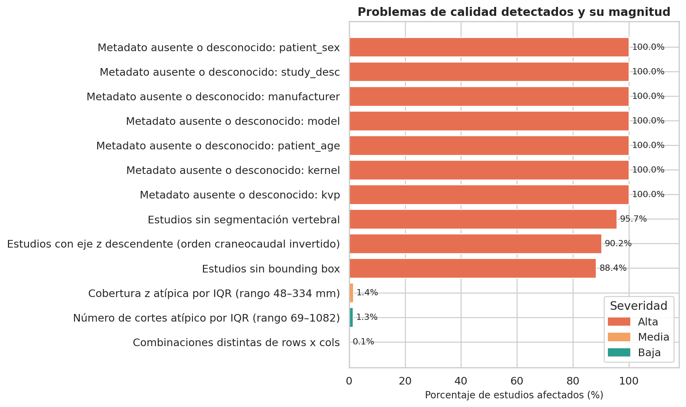

| # | Hallazgo | Magnitud | Severidad |
|---|---|---:|---|
| 1 | Estudios sin segmentación vertebral | 1 932 / 2 019 (95.69 %) | Alta |
| 2 | **Estudios con eje z descendente** | **1 822 / 2 019 (90.24 %)** | Alta |
| 3 | Estudios sin bounding box | 1 784 / 2 019 (88.36 %) | Alta |
| 4 | Metadatos des-identificados: `manufacturer`, `model`, `kernel`, `kvp`, `patient_sex`, `patient_age`, `study_desc` | 7 columnas, 2 019 / 2 019 (100 %) | Alta |
| 5 | Valores distintos de `pixel_spacing_x` | 324 valores (0.190 – 0.713 mm) | Media |
| 6 | Valores distintos de `slice_thickness` | 10 valores (0.488 – 1.000 mm) | Media |
| 7 | Estudios con caja **y** segmentación (única vía de validación cruzada) | 40 / 2 019 (1.98 %) | Media |
| 8 | Combinaciones distintas de `rows × cols` | 3 combinaciones; 3 estudios (0.15 %) no son 512×512 | Media |
| 9 | Cobertura `z_extent` atípica por IQR | 29 / 2 019 (1.44 %), rango 48.5 – 334.4 mm | Media |
| 10 | `n_slices` atípico por IQR | 27 / 2 019 (1.34 %), rango 69 – 1 082 | Baja |
| 11 | Inconsistencia `patient_overall` vs `OR(C1–C7)` | **0 / 2 019 (0 %)** | Verificado, limpio |
| 12 | Valores nulos en las 8 etiquetas | **0** | Verificado, limpio |
| 13 | Estudios duplicados | **0** | Verificado, limpio |
| 14 | UID de `train.csv` sin carpeta de imágenes | **0** | Verificado, limpio |
| 15 | **Huecos en la numeración de cortes** (`slice_gap`) | **0** | Verificado, limpio |
| 16 | Estudios sin `ImagePositionPatient` legible | **0** | Verificado, limpio |
| 17 | Cajas que exceden el marco del corte | **0** | Verificado, limpio |
| 18 | Estudios con caja pero `patient_overall = 0` | **0** | Verificado, limpio |

**El hallazgo nuevo y más importante de esta tabla es el número 2.** El eje z
descendente no es una excepción que afecte a unos pocos estudios: es **la norma, con el
90.24 % de los casos**. Solo 197 estudios apilan en sentido ascendente. Cualquier
pipeline que asuma un sentido craneocaudal fijo —o que ordene los cortes por el nombre
del archivo— procesará nueve de cada diez volúmenes al revés. Y lo hará en silencio,
sin lanzar ningún error.

Conviene leerlo junto al hallazgo 15: **no hay un solo estudio con huecos en la
numeración**, y los 2 019 tienen `ImagePositionPatient` legible (hallazgo 16). Es decir,
el orden de los archivos es perfectamente contiguo y aun así mayoritariamente inverso al
anatómico. La contigüidad invita precisamente al error: como la numeración no tiene
saltos, ordenar por nombre *parece* correcto.

**Sobre la des-identificación (hallazgo 4).** Son **siete** columnas constantes en
`"Desconocido"`, no tres: además de `manufacturer`, `kernel` y `patient_sex`, también
`model`, `kvp`, `patient_age` y `study_desc`. El conjunto fue des-identificado antes de
publicarse y esos tags se eliminaron de las cabeceras. Dos consecuencias: la prueba de
asociación entre fabricante y etiqueta es vacía (χ² = 0.00, p = 1.0000, que no significa
ausencia de asociación sino ausencia de datos), y **no es posible analizar sesgo
demográfico ni por sitio de origen** con los datos publicados.

**Sobre `rows × cols` (hallazgo 8).** 2 016 estudios son 512×512, dos son 768×768 y uno
es 512×519. Como el 99.85 % es 512×512, expresar el área de la lesión como porcentaje de
512×512 (sección 5.3) es válido, pero esos tres estudios deben recalcularse con sus
dimensiones propias si se usan para medir tamaños.

### 4.6 Operaciones de limpieza y preprocesamiento

Cada operación se deriva de un hallazgo concreto del análisis, no de una lista genérica.
Ninguna de ellas elimina observaciones: la dispersión observada es variabilidad legítima
de protocolo entre 12 instituciones, y descartarla sesgaría el conjunto justamente en la
dirección que el conjunto pretende corregir.

**1. Normalizar la orientación antes de cualquier operación volumétrica.**
*Deriva de:* el hallazgo más contundente del reporte de calidad. **El 90.24 % de los
estudios (1 822 de 2 019) apila en sentido descendente**, y solo 197 lo hacen en sentido
ascendente. A la vez, la numeración de archivos es contigua en el 100 % de los casos
(`slice_gap = 0` en todos) y los 2 019 tienen `ImagePositionPatient` legible. Esa
combinación es una trampa: como no hay huecos, ordenar por el nombre del archivo parece
correcto y no produce ningún error visible, pero invierte nueve de cada diez volúmenes.
*Operación:* ordenar los cortes por `ImagePositionPatient[2]` —nunca por nombre de
archivo ni por `InstanceNumber`—, registrar `z_dir` como variable de control y reorientar
las máscaras NIfTI, que están almacenadas en plano sagital mientras los DICOM son
axiales. Toda superposición de máscara debe validarse **visualmente** antes de darla por
buena; la mera coincidencia de dimensiones no demuestra alineación. Dado que el sentido
descendente es el mayoritario, conviene además fijar una convención explícita del
proyecto (por ejemplo, z creciente = craneal → caudal) y afirmarla con un *assert* en el
pipeline, en lugar de confiar en que el orden de lectura sea el correcto.

**2. Convertir a unidades Hounsfield y remuestrear a espaciado isotrópico 1×1×1 mm.**
*Deriva de:* los píxeles crudos no son unidades HU, y el espaciado varía entre estudios
(`pixel_spacing` de 0.190 a 0.713 mm; `slice_thickness` de 0.488 a 1.000 mm).
*Operación:* aplicar `HU = pixel_array × RescaleSlope + RescaleIntercept` y luego
remuestrear. Sin esto, un mismo número de píxeles representa distintos milímetros según
el hospital de origen, y cualquier medida de tamaño de lesión es incomparable entre
estudios.

**3. Aplicar ventana ósea y descartar el rango de aire.**
*Deriva de:* el rango HU va de −1 000 (aire) a +3 000 (hueso cortical), mientras la
pantalla y la mayoría de las arquitecturas trabajan sobre 256 niveles. La figura 5.4.1
muestra que sin ventana la imagen es prácticamente inservible.
*Operación:* ventana ósea (centro 400, ancho 1 800) como vista primaria, y ventana de
tejido blando (centro 40, ancho 400) como vista complementaria. Recortar el rango de
aire elimina voxeles que no aportan señal diagnóstica.

**4. Recortar a la región C1–C7 usando las segmentaciones.**
*Deriva de:* el recorrido anatómico real va de 48.5 mm a 334.4 mm. El extremo inferior
es un estudio cervical muy focalizado y el superior una cobertura cervicotorácica amplia:
en ambos casos la proporción del volumen que ocupa C1–C7 varía bastante.
*Operación:* usar las 87 segmentaciones disponibles para entrenar o calibrar un
localizador vertebral y propagarlo al resto. Esto homogeneiza el campo de visión sin
descartar ningún estudio. Debe documentarse que el recorte propagado introduce un error
no cuantificado en este EDA.

**5. Decidir explícitamente el tratamiento de las etiquetas ambiguas.**
*Deriva de:* la documentación oficial advierte que puede haber estudios positivos sin
nivel asignado. **En este subconjunto de entrenamiento la inconsistencia no se
materializa: los 2 019 estudios cumplen `patient_overall == OR(C1..C7)`.**
*Operación:* mantener el chequeo en el pipeline (`ETI-03` del reporte) porque los
conjuntos de prueba pública y privada pueden comportarse distinto, y porque la ausencia
de inconsistencias en *train* no garantiza su ausencia en producción. La regla adoptada
—si aparece un positivo sin nivel, se conserva para la tarea binaria y se excluye de la
tarea por nivel— queda fijada de antemano, no improvisada al encontrarlo.

**6. Partición estratificada por `patient_overall` y por nivel.**
*Deriva de:* dos hechos. El desbalance entre niveles es fuerte (C7 con 393 casos frente
a C3 con 73, una razón de 5.4 : 1), y las variables de adquisición difieren
significativamente entre clases, siendo `n_slices` la de mayor asociación
(p = 1.8 × 10⁻⁸) una vez corregido `z_extent` (sección 5.2).
*Operación:* estratificar por `patient_overall` **y** por nivel fracturado, agrupando
siempre por `StudyInstanceUID` para que ningún corte del mismo paciente caiga a ambos
lados de la partición. La estratificación por fabricante prevista en el diseño original
**no es aplicable**, porque la variable está des-identificada —junto con `model`,
`kernel`, `kvp`, `patient_sex`, `patient_age` y `study_desc`—; en su lugar debe
estratificarse por `n_slices` discretizado, que es el mejor sustituto observable del
protocolo de adquisición.

---

## 5. Hallazgos

### 5.1 Etiquetas: qué se está prediciendo

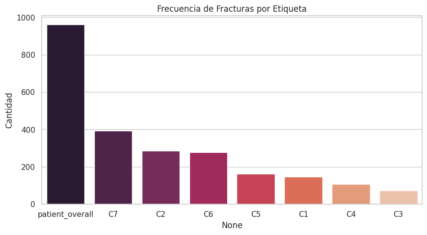

**Interpretación.** De los 2 019 estudios, **961 (47.60 %) presentan fractura cervical**.
La clase binaria está prácticamente balanceada, lo que es inusual en imagen médica y
significa que el reto **no** está en el desbalance de la tarea principal: una métrica de
exactitud simple no queda inflada por una clase mayoritaria. El desbalance aparece un
nivel más abajo, al pasar de "¿hay fractura?" a "¿en qué vértebra?". Ahí las frecuencias
se separan con claridad: **C7 con 393 casos (19.47 % del conjunto, 40.89 % de los
positivos)**, seguida de **C2 con 285** y **C6 con 277**; en el otro extremo, **C3 con
solo 73 casos (3.62 %)**. La razón entre el nivel más frecuente y el más raro es de
**5.4 : 1**, suficiente para que un clasificador multietiqueta sin ponderación aprenda a
ignorar C3 y C4.

Los 961 pacientes positivos acumulan **1 444 niveles fracturados**, es decir **1.50
vértebras fracturadas por paciente positivo**. La tarea es multietiqueta, no
multiclase: las etiquetas no son mutuamente excluyentes.

**Validación contra la literatura.** C2, C6 y C7 concentran **955 de las 1 444 fracturas,
el 66.14 %**, y C7 es efectivamente el nivel más frecuente. La cifra es consistente con
las dos referencias disponibles: el 62.4 % que reporta la descripción oficial del
conjunto completo (Lin et al., 2023) y el 63.3 % que Goldberg et al. (2001) midieron en
un estudio multicéntrico de 21 instituciones. La diferencia de unos 3 puntos
porcentuales respecto del 62.4 % era esperable, porque aquella cifra se calcula sobre
los 3 112 estudios del conjunto publicado y esta sobre los 2 019 de entrenamiento. Que
un subconjunto de 2 019 estudios de 12 instituciones reproduzca un patrón epidemiológico
descrito hace dos décadas es una **verificación externa de la validez del conjunto**: no
es una muestra sesgada hacia un tipo de fractura infrecuente.

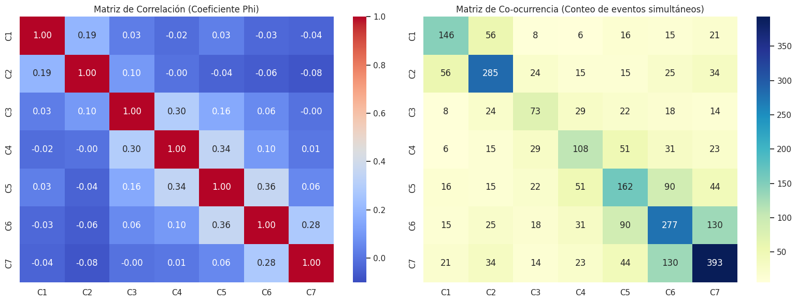

**Interpretación.** Al ser todas las variables binarias, la correlación de Pearson entre
ellas equivale al coeficiente phi. No hay ninguna correlación fuerte —ninguna supera
0.85, el umbral que obligaría a eliminar variables redundantes—, pero los coeficientes
más altos aparecen sistemáticamente **entre vértebras adyacentes**. Tiene sentido
biomecánico: la fractura ocurre porque una fuerza se aplica sobre un segmento, y esa
fuerza se disipa hacia las vértebras contiguas. La matriz de co-ocurrencia confirma el
mismo patrón en conteos absolutos. La implicación para el modelado es que **tratar C1–C7
como siete problemas binarios independientes desperdicia estructura**: la vecindad
anatómica es información aprovechable.

El desglose de combinaciones refuerza la lectura. De las 393 fracturas de C7, **223 son
aisladas** y las 170 restantes (43 %) coexisten con otro nivel, muy frecuentemente C6
(`C6 + C7` aparece 77 veces, la cuarta combinación más común). En C2, 180 de 285 son
aisladas. La combinación `C1 + C2` aparece 42 veces, coherente con el complejo
atlanto-axial como unidad funcional.

### 5.2 Metadatos de adquisición: heterogeneidad y riesgo de atajo

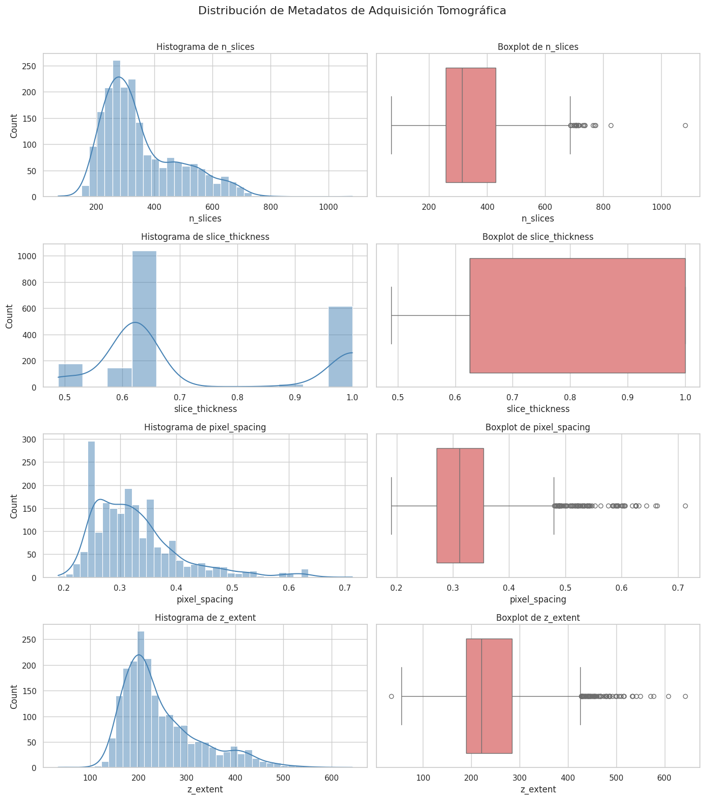

**Interpretación.** `slice_thickness` y `pixel_spacing` son notablemente homogéneos
—medianas de **0.625 mm** y **0.312 mm**, con desviaciones estándar pequeñas—, lo cual
concuerda con el criterio de inclusión oficial de corte fino. `slice_thickness` no
produce **ningún** valor atípico por IQR, el único caso así en todo el conjunto; toma
apenas **10 valores distintos**, dominados por 0.625 mm (1 041 estudios) y 1.000 mm
(618). `pixel_spacing`, en cambio, toma **324 valores distintos** entre 0.190 y 0.713 mm,
siempre isotrópico en el plano (`pixel_spacing_x` = `pixel_spacing_y` en los 2 019
estudios). La heterogeneidad de resolución está por tanto en el plano axial, no en el
eje z.

> **Corrección respecto de la figura.** La figura anterior y el notebook 02 calculan
> `z_extent` como `n_slices × slice_thickness`. Al recalcularlo como
> `|z_last − z_first|` con `ImagePositionPatient[2]` —el recorrido anatómico real— las
> cifras cambian de forma sustancial, y la lectura correcta es la segunda:
>
> | | Aproximación `n_slices × grosor` | **Recorrido físico real** |
> |---|---:|---:|
> | Mediana | 220.6 mm | **198.0 mm** |
> | Media | 246.1 mm | **197.6 mm** |
> | Desviación estándar | 81.3 mm | **28.9 mm** |
> | Rango | 33.7 – 642.6 mm | **48.5 – 334.4 mm** |
>
> La aproximación **sobreestima en 2 017 de los 2 019 estudios (99.9 %)**; solo dos la
> subestiman. La mediana de sobreestimación es de apenas 1.0 mm, pero la media es de
> 48.5 mm y el máximo de 325 mm. Esa cola pesada es exactamente el solapamiento entre
> cortes: cuando el incremento de reconstrucción es menor que el grosor nominal,
> multiplicar cuenta el mismo tejido varias veces.

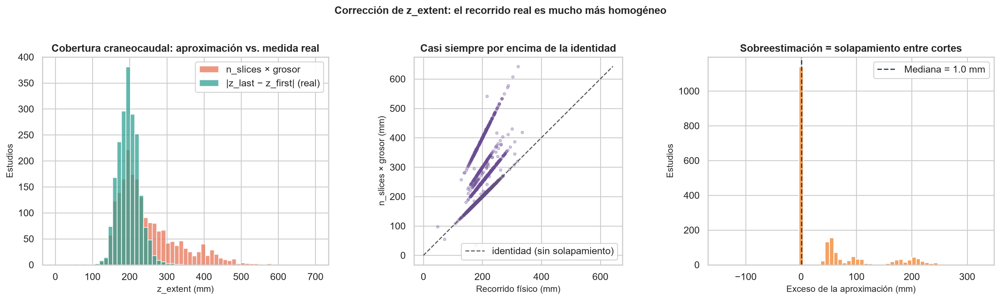

**Interpretación.** El panel izquierdo superpone las dos distribuciones: la aproximación
(naranja) arrastra una cola larga hasta 642 mm que **no existe** en la medida real
(verde), concentrada alrededor de 200 mm. El panel central sitúa cada estudio frente a
la diagonal de identidad —donde caería si no hubiera solapamiento— y revela algo que la
tabla no muestra: los puntos se agrupan en **bandas diagonales discretas**, una por cada
valor de `slice_thickness`. Es la huella de los protocolos de reconstrucción de los
distintos sitios. El panel derecho cuantifica el exceso: un pico enorme en ~1 mm (la
mayoría de estudios reconstruye con incremento ≈ grosor) y grupos secundarios en torno a
50, 100 y 200 mm, que son los estudios con solapamiento de ½, ⅓ y ¼ de corte.

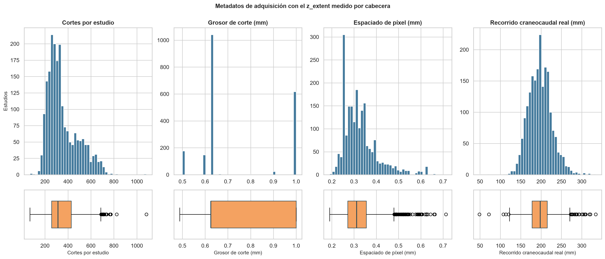

**Interpretación.** Las cuatro variables de adquisición medidas correctamente.
`slice_thickness` es casi bimodal (0.625 y 1.000 mm concentran 1 659 de 2 019 estudios),
`pixel_spacing` es unimodal con cola derecha, y `z_extent` real resulta marcadamente más
simétrico y compacto que en la figura anterior de la sección. Es esta versión —no la del
notebook 02— la que sustenta las cifras del texto.

La corrección cambia la conclusión. Con el recorrido real, **la cobertura anatómica es
mucho más homogénea de lo que sugería la aproximación**: la desviación estándar cae de
81.3 mm a 28.9 mm y el máximo de 642.6 mm a 334.4 mm. No hay barridos de politrauma de
cuerpo entero disfrazados en el conjunto; 334 mm es una cobertura cervicotorácica
amplia, pero plausible. El criterio de inclusión oficial se sostiene mejor de lo que
parecía. Lo que sí varía mucho entre sitios es **cuántos cortes se usan para cubrir esa
longitud similar** —`n_slices` va de 69 a 1 082 con media 352 frente a mediana 314—, es
decir, el grado de solapamiento en la reconstrucción.

El análisis de atípicos por IQR sobre las variables correctas arroja **27 casos en
`n_slices` (1.34 %)** y **29 en `z_extent` físico (1.44 %)**, muy por debajo de los 84
(4.16 %) que daba la aproximación. **No se eliminan.** Descartarlos borraría los
protocolos menos representados, empeorando el problema de generalización que motiva el
conjunto. La normalización correcta es el remuestreo isotrópico y el recorte a C1–C7
(operaciones 2 y 4 de la sección 4.6).

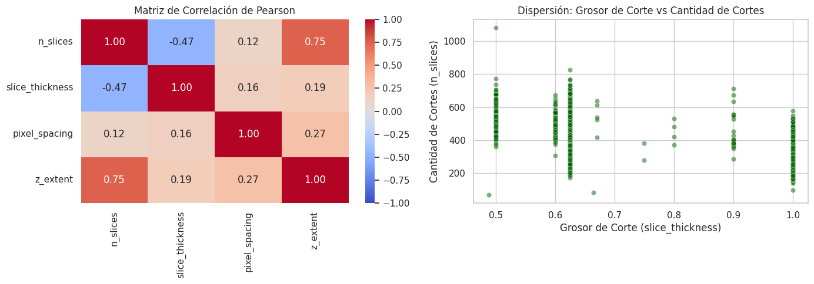

**Interpretación.** Ninguna correlación entre variables numéricas supera 0.85, así que
no hay redundancia que obligue a eliminar variables. Las asociaciones más fuertes son las
esperadas por construcción: `n_slices` con `z_extent` —un recorrido más largo requiere
más cortes— y `n_slices` con `slice_thickness`, con **signo negativo**, porque para
cubrir la misma longitud con cortes más gruesos se necesitan menos. El diagrama de
dispersión muestra que esta última relación **no es lineal sino hiperbólica**, lo cual es
aritmética, no un hallazgo empírico: `z_extent ≈ n_slices × slice_thickness`, de modo que
a `z_extent` aproximadamente constante, `n_slices` varía como el inverso del grosor. La
consecuencia práctica es que un coeficiente de Pearson **subestima** esta dependencia; la
relación es determinista, no estadística.

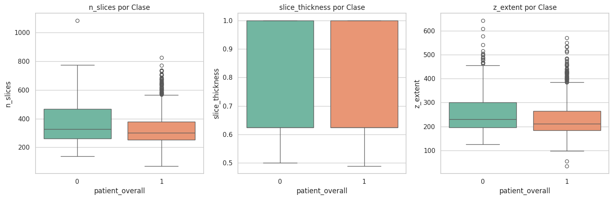

**Interpretación — riesgo de *shortcut learning*.** La prueba prevista para detectar
atajos, χ² entre fabricante y `patient_overall`, es **inaplicable**: la variable está
des-identificada y toma un solo valor, de modo que el resultado (χ² = 0.00, p = 1.0000)
no informa nada. Sin embargo, las pruebas de Mann-Whitney sobre las variables de
adquisición **sí detectan diferencias significativas** entre estudios positivos y
negativos:

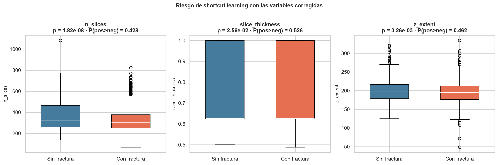

| Variable | U | p | P(positivo > negativo) |
|---|---:|---:|---:|
| `n_slices` | 434 736 | 1.82 × 10⁻⁸ | 0.428 |
| `z_extent` (recorrido físico) | 469 875 | 3.26 × 10⁻³ | 0.462 |
| `slice_thickness` | 535 033 | 2.56 × 10⁻² | 0.526 |

Aquí la corrección de `z_extent` vuelve a importar. Calculado con la aproximación
`n_slices × grosor`, `z_extent` parecía la señal más fuerte del conjunto
(p = 8.47 × 10⁻¹⁰, efecto 0.421). Recalculado con el recorrido anatómico real, **el
efecto se reduce a menos de la mitad** (p = 3.26 × 10⁻³, efecto 0.462). La diferencia
aparente no estaba en la anatomía del paciente sino en el solapamiento de reconstrucción
—es decir, en el protocolo—, y al medir la longitud real casi se disuelve. Con la
corrección, **`n_slices` pasa a ser la variable con mayor asociación**, lo que es
coherente: es la que más directamente codifica el protocolo del sitio.

La lectura correcta requiere separar significancia de magnitud. Con n = 2 019 la
significancia se alcanza con efectos pequeños, y eso es lo que ocurre: el tamaño de
efecto de lenguaje común se aleja del valor nulo de 0.50 apenas entre 0.026 y 0.072. En
términos prácticos, los estudios positivos tienden a tener **algo menos cortes** que los
negativos, pero la superposición entre ambas distribuciones es casi total y ninguna de
estas variables permitiría clasificar por sí sola.

Aun así, el hallazgo **no es descartable**, y esa es la conclusión operativa: existe una
asociación real, pequeña pero sistemática, entre el protocolo de adquisición y la
etiqueta. Una red que reciba el volumen completo puede aprender a leer el muestreo del
barrido en lugar de la discontinuidad ósea. Como `manufacturer` no está disponible para
controlar el efecto, **`n_slices` discretizado es el mejor sustituto observable del sitio
de origen** y debe usarse para estratificar la partición (operación 6 de la sección 4.6).
Recortar a C1–C7 y remuestrear a espaciado isotrópico antes de clasificar elimina buena
parte de este atajo por construcción, porque homogeneiza a la vez el campo de visión y la
densidad de muestreo.

### 5.3 Anotación espacial: el hallazgo central del reto

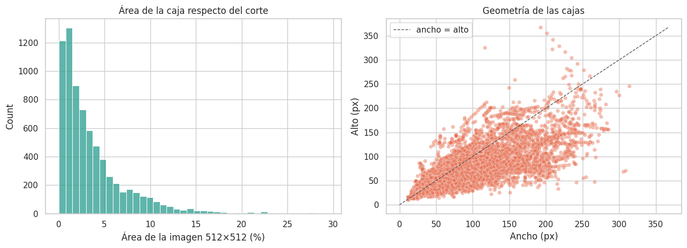

**Interpretación — este es el resultado más importante del análisis.** La región
delimitada por la caja ocupa una **mediana del 2.415 % del corte de 512 × 512**, con
percentil 95 en 11.02 % y percentil 99 en 18.04 %. En píxeles: unos **6 331 de los
262 144** del campo de visión. Dicho de otro modo, **el fondo supera a la región de
interés en una proporción cercana a 41 : 1**, y la caja es todavía un **límite superior**
del tamaño real de la lesión, porque incluye la vértebra y tejido circundante; la
discontinuidad ósea propiamente dicha es menor.

Esto condiciona toda la estrategia de modelado. Una clasificación directa del volumen
completo obliga a la red a encontrar una señal que ocupa el 2 % de la imagen, y en
posiciones que varían entre pacientes. El diagrama de dispersión ancho-vs-alto muestra
además que las cajas son mayoritariamente **más anchas que altas** (razón de aspecto
mediana 1.25, media 1.36), consistente con la orientación de los cuerpos vertebrales en
el plano axial. Este único número —2.4 %— es el argumento cuantitativo que justifica un
**enfoque en dos etapas**: localizar primero, clasificar después sobre el recorte.

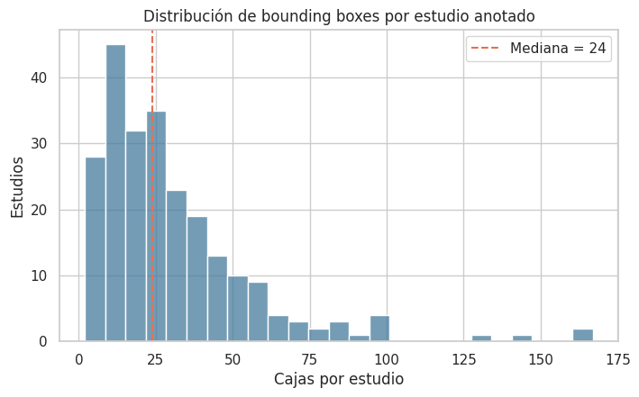

**Interpretación.** Un estudio anotado tiene una **mediana de 24 cajas**, con media 30.7
y un máximo de **167**. La distribución tiene una cola derecha marcada. La lectura que
hay que evitar es contar cajas como si fueran fracturas: una sola fractura se anota en
todos los cortes consecutivos donde es visible, de modo que **el número de cajas mide la
extensión craneocaudal de la lesión, no el número de lesiones independientes**. Las
7 217 cajas del archivo corresponden a un número de fracturas sustancialmente menor.

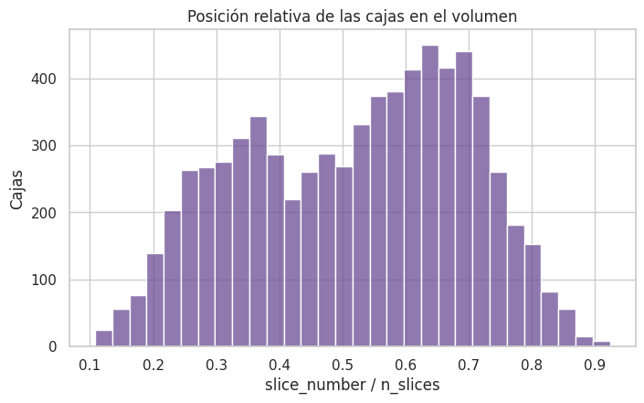

**Interpretación.** La posición relativa mediana de las cajas es **0.543**, es decir,
cerca del centro de la pila, y la distribución se concentra en la región central. Dos
advertencias impiden leer esto como una localización anatómica. Primera, la razón
`slice_number / n_slices` describe posición **dentro del archivo**, no coordenada
física; como el sentido craneocaudal se invierte entre estudios, una misma vértebra cae
en posiciones relativas opuestas según el estudio. Segunda, el denominador varía con el
protocolo: en un politrauma de 642 mm, la región cervical ocupa una fracción mucho menor
de la pila que en un estudio cervical focalizado. La concentración central es, por tanto,
compatible con que el cuello quede centrado en el barrido, pero **no permite recortar por
posición relativa fija**: para eso hay que usar las segmentaciones.

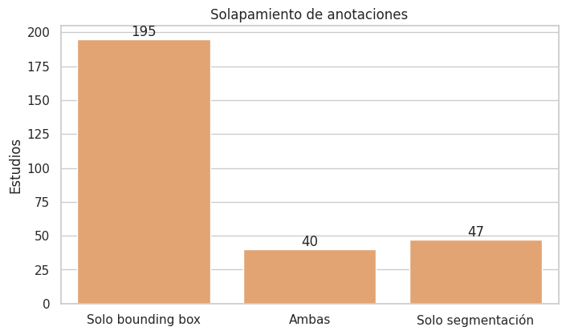

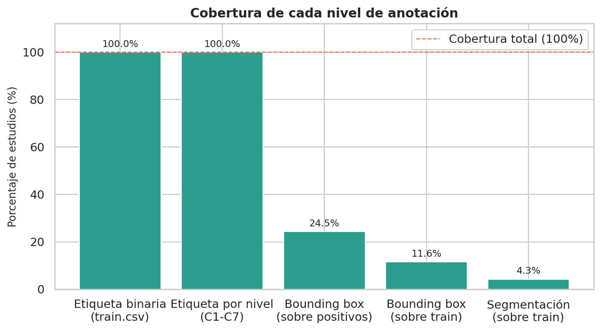

**Interpretación.** La segunda figura resume la estructura piramidal de la supervisión:
los 2 019 estudios tienen etiqueta binaria y por nivel al 100 %, pero la localización cae
abruptamente. Las cajas cubren **235 estudios, el 11.64 % del conjunto y solo el
24.45 % de los casos positivos**. Las segmentaciones cubren **87 estudios (4.31 %)**. Y
la intersección —los estudios con ambos tipos de anotación— es de apenas **40 estudios
(1.98 %)**: 195 tienen solo caja y 47 solo segmentación. Tres consecuencias:

1. **La ausencia de caja no significa ausencia de fractura.** Tres de cada cuatro casos
   positivos no tienen localización. Usar los estudios sin caja como negativos para un
   detector introduciría ruido de etiqueta masivo.
2. Una etapa de localización supervisada dispone, como techo, de menos de la cuarta parte
   de los positivos.
3. Esos **40 estudios son el único subconjunto donde puede verificarse que la máscara
   NIfTI quedó correctamente alineada con el volumen DICOM**, comprobando que la caja
   cae dentro de la vértebra que la máscara identifica. Es un recurso de validación
   escaso y conviene no gastarlo como conjunto de prueba.

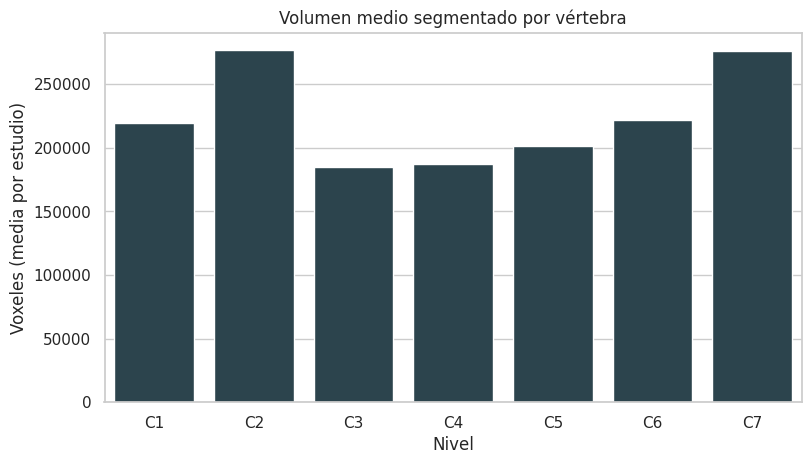

**Interpretación.** El volumen segmentado por vértebra dibuja un perfil en U: **C2 y C7
son las más voluminosas** (≈276 700 y ≈276 500 voxeles de media respectivamente),
mientras **C3 y C4 son las más pequeñas** (≈185 300 y ≈187 200). El patrón es
anatómicamente correcto —el axis y la séptima cervical son las vértebras de mayor
tamaño del segmento— y sirve como **verificación de que la carga y orientación de las
máscaras es coherente**: una máscara mal orientada no reproduciría el perfil anatómico
esperado. La dispersión es alta (desviación estándar del orden del 60 % de la media,
máximos que cuadruplican la mediana) porque los conteos están en **voxeles, no en mm³**:
sin multiplicar por el volumen de voxel de cada cabecera, los estudios de mayor
resolución producen conteos mayores para la misma anatomía. Para comparar volúmenes
físicos habría que incorporar el espaciado.

Además, el **100 % de las máscaras contiene al menos una etiqueta torácica**, pero la
cobertura por nivel varía entre 0 % y 100 %: prácticamente todas incluyen T1, casi
ninguna llega a T12. Recortar "de C1 a T1" es viable; asumir T1–T12 completos no lo es.

### 5.4 Evidencia visual: por qué el problema es difícil

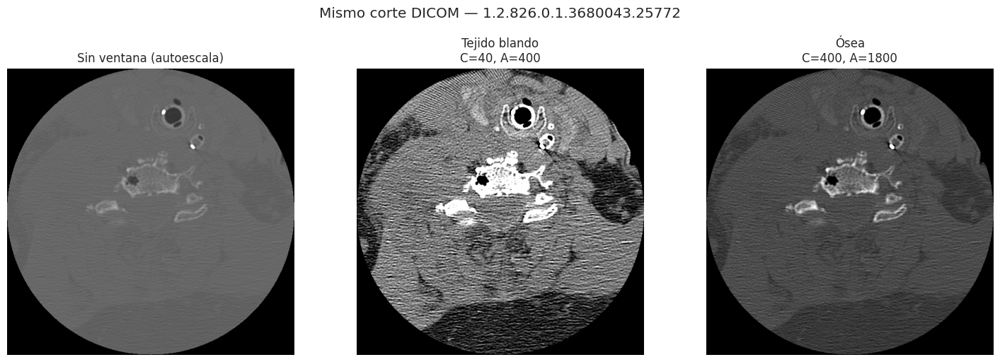

**Interpretación.** Las tres imágenes son **el mismo corte DICOM**. A la izquierda, la
autoescala sobre el rango HU completo (−1 000 a +3 000) produce una imagen inservible:
el aire y el hueso comprimen todo el tejido intermedio en unos pocos niveles de gris. En
el centro, la ventana de tejido blando (C = 40, A = 400) resalta músculo y estructuras
vecinas pero satura el hueso. A la derecha, la ventana ósea (C = 400, A = 1 800)
conserva el contraste entre cortical y trabécula, que es donde se manifiesta una
fractura. La conclusión operativa es que **la elección de ventana no es un ajuste
estético sino una decisión de preprocesamiento que determina si la señal diagnóstica
está presente o no** en la entrada del modelo.

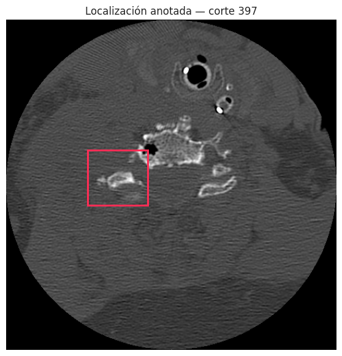

**Interpretación.** La caja del ejemplo ocupa **3.016 % del corte**, muy cerca de la
mediana global de 2.415 %. La figura hace tangible la cifra de la sección 5.3: la región
anotada es un rectángulo pequeño que, sin la anotación, compite con más de 260 000
píxeles de campo de visión. Es la traducción visual del argumento a favor de localizar
antes de clasificar.

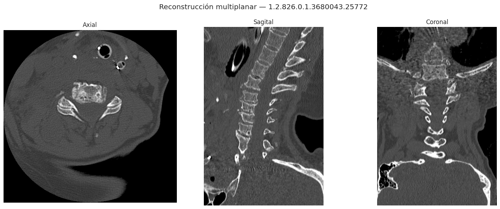

**Interpretación.** La vista axial es la adquisición original; las vistas sagital y
coronal se obtienen reordenando la pila por `ImagePositionPatient[2]` y ajustando las
proporciones con `PixelSpacing` y la separación real entre cortes, para que la geometría
no quede deformada. **La vista sagital es la que el radiólogo usa para evaluar la
alineación cervical** y la continuidad de los muros vertebrales a lo largo del eje
craneocaudal: es ahí donde una discontinuidad invisible en un corte axial aislado se
vuelve evidente. Que esta reconstrucción dependa por completo del ordenamiento correcto
del volumen es la justificación de la operación 1 de la sección 4.6.

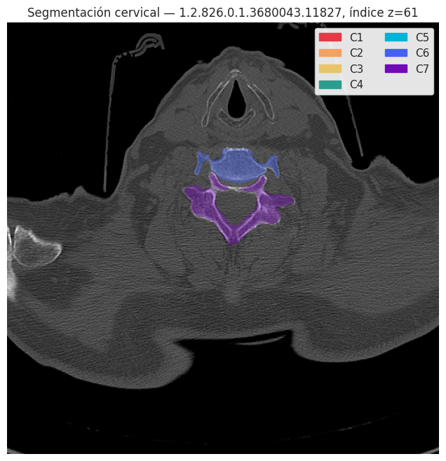

**Interpretación.** La máscara se superpone al corte coloreada por vértebra, tras
reorientarla del plano sagital en que se almacena el NIfTI al plano axial del DICOM. Las
formas de `(208, 512, 512)` coinciden entre máscara y volumen, pero **la coincidencia de
dimensiones no demuestra alineación**: una máscara espejada o invertida en z tiene
exactamente la misma forma. La validación es visual y obligatoria —cada color debe
permanecer dentro del cuerpo y el arco de su vértebra, sin reflejo izquierda-derecha ni
inversión craneocaudal—, y en esta figura se cumple. Es la comprobación que autoriza a
usar las segmentaciones para recortar C1–C7 en la operación 4.

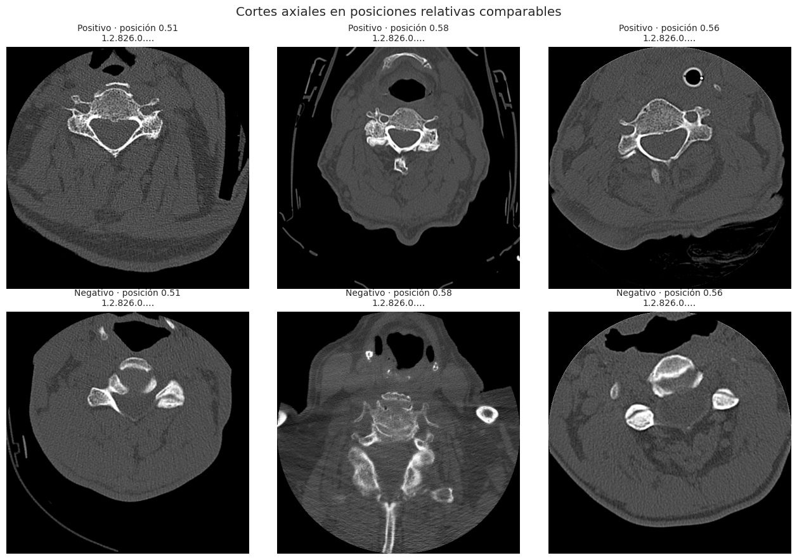

**Interpretación.** La rejilla compara cortes axiales en ventana ósea de tres casos
positivos, tomados en los cortes anotados, y tres negativos seleccionados en posiciones
relativas comparables de su pila para reducir las diferencias de cobertura anatómica. El
punto de la figura es negativo y deliberado: **a simple vista, en un corte aislado, las
dos filas no son distinguibles**. La discontinuidad cortical que define la fractura es
sutil a esta escala, y la lectura clínica requiere recorrer el volumen y consultar la
reconstrucción sagital. La rejilla es ilustrativa y no constituye una evaluación
diagnóstica, pero explica con claridad por qué un clasificador que opere corte a corte,
sin contexto tridimensional ni localización previa, parte en desventaja.

---

## 6. Conclusiones y siguientes pasos

### 6.1 Síntesis de los hallazgos

**El conjunto está limpio; el problema es otro.** De 32 chequeos de calidad, 12
verifican y salen limpios: cero nulos, cero duplicados, cero UID sin imágenes, cero
huecos en la numeración de cortes, cero cajas fuera de marco y consistencia total entre
`patient_overall` y `OR(C1..C7)` en los 2 019 estudios. Las horas que un proyecto típico
dedica a imputación y deduplicación aquí no aplican. Los tres obstáculos reales son la
**orientación no normalizada**, la **heterogeneidad de adquisición** entre 12
instituciones y la **supervisión parcial** de la anotación espacial.

**Nueve de cada diez volúmenes están apilados en sentido descendente.** 1 822 de 2 019
estudios (90.24 %) tienen el eje z descendente. Es el hallazgo con mayor potencial de
daño silencioso del análisis, y se agrava porque la numeración de archivos es contigua en
el 100 % de los casos: ordenar por nombre parece correcto, no lanza ningún error, y
procesa la gran mayoría de los volúmenes invertidos.

**La tarea binaria está balanceada; la tarea por nivel no.** El 47.60 % de los estudios
son positivos, una proporción cómoda. Pero al bajar al nivel vertebral, C7 (393 casos)
supera a C3 (73) en razón de 5.4 : 1, y los 961 positivos acumulan 1 444 niveles
fracturados: es un problema multietiqueta con estructura de vecindad, donde las
correlaciones más altas se dan entre vértebras adyacentes.

**La distribución anatómica reproduce la literatura.** C2, C6 y C7 concentran el 66.14 %
de las fracturas y C7 es el nivel más frecuente, en línea con el 62.4 % del conjunto
completo (Lin et al., 2023) y el 63.3 % de Goldberg et al. (2001). El conjunto de
entrenamiento no está sesgado hacia un patrón epidemiológico atípico.

**La lesión ocupa el 2.4 % del corte.** Es el hallazgo que más condiciona el diseño
posterior: mediana de 2.415 % del campo de visión de 512 × 512, con la caja actuando
como límite superior del tamaño real. La relación fondo-a-lesión ronda 41 : 1.

**La anotación espacial es escasa y no es exhaustiva.** Solo el 11.64 % de los estudios
tiene caja, el 4.31 % tiene segmentación y apenas el 1.98 % tiene ambas. Tres de cada
cuatro casos positivos carecen de localización, de modo que la ausencia de caja no puede
interpretarse como ausencia de fractura.

**Existe un riesgo de atajo pequeño pero real.** Siete columnas de metadatos están
des-identificadas (`manufacturer`, `model`, `kernel`, `kvp`, `patient_sex`,
`patient_age`, `study_desc`), de modo que la prueba prevista para detectarlo es vacía.
Las variables de adquisición sí difieren de forma significativa entre clases, con
`n_slices` como la más asociada (p = 1.8 × 10⁻⁸, P(pos > neg) = 0.428), aunque con
tamaños de efecto pequeños. La asociación no basta para clasificar, pero sí para que un
modelo la explote como pista espuria si no se controla.

**Medir bien cambia la conclusión.** Calcular `z_extent` como `n_slices × grosor`
sobreestima el recorrido anatómico en el 99.9 % de los estudios y triplica su desviación
estándar (81.3 mm frente a 28.9 mm reales). Con la medida correcta, la cobertura del
conjunto resulta bastante homogénea (48.5 – 334.4 mm) y el que parecía el atajo más
fuerte se reduce a menos de la mitad (de p = 8.5 × 10⁻¹⁰ a p = 3.3 × 10⁻³). Lo que
variaba no era la anatomía sino el solapamiento de reconstrucción.

### 6.2 Implicaciones para las siguientes etapas

**1. Adoptar un enfoque en dos etapas.** Es la conclusión que se desprende directamente
de los números: si la lesión ocupa el 2.4 % del corte, clasificar el volumen completo
obliga al modelo a buscar una señal diminuta en un campo enorme. La alternativa es
localizar o segmentar primero las vértebras C1–C7, recortar cada una y clasificar sobre
el recorte. El recorte resuelve simultáneamente tres problemas: reduce la relación
fondo-a-lesión, homogeneiza el campo de visión entre protocolos —neutralizando el atajo
por `z_extent`— y convierte un problema multietiqueta en siete decisiones locales
comparables entre sí.

**2. Tratar la localización como etiqueta débil, nunca como verdad exhaustiva.** Las
cajas y las segmentaciones sirven para entrenar la etapa de localización y para validar
la orientación, pero los estudios sin anotación **no son negativos**. Un detector
entrenado con esa suposición aprendería a no detectar.

**3. Reservar los 40 estudios con caja y segmentación como recurso de verificación.**
Son el único subconjunto que permite comprobar de forma independiente que las máscaras
NIfTI están alineadas con los volúmenes DICOM. Conviene usarlos para validar el pipeline
geométrico antes que como muestra de evaluación.

**4. Fijar el preprocesamiento geométrico antes de cualquier experimento.** Ordenar por
`ImagePositionPatient[2]`, convertir a HU, remuestrear a 1×1×1 mm y aplicar ventana ósea
son decisiones que, mal tomadas, producen resultados silenciosamente incorrectos: no
lanzan error, solo degradan el desempeño de forma inexplicable. La validación visual de
la superposición máscara-volumen debe ser un paso obligatorio, no opcional.

**5. Estratificar por `patient_overall`, por nivel y por `z_extent` discretizado,
agrupando por paciente.** Es la única forma de que la partición no filtre información
entre conjuntos ni deje niveles raros como C3 concentrados en un solo lado.

**6. Medir la geometría con la cabecera, no con aritmética sobre el conteo de cortes.**
La diferencia entre `|z_last − z_first|` y `n_slices × grosor` no es un matiz: cambió el
rango aparente del conjunto de 33.7 – 642.6 mm a 48.5 – 334.4 mm, redujo los atípicos de
84 a 29 y debilitó a más de la mitad la asociación con la etiqueta. Cualquier decisión de
recorte o remuestreo debe partir de `ImagePositionPatient`, no de un producto.

### 6.3 Limitaciones de este análisis

- La sección 5.2 conserva las figuras originales del notebook 02, que usan la
  aproximación `n_slices × slice_thickness`, **junto a** las versiones corregidas con el
  recorrido físico. Se mantienen ambas de forma deliberada: la comparación es en sí misma
  el hallazgo metodológico. Las cifras del texto y las conclusiones provienen siempre de
  la medida corregida.
- Las variables `manufacturer`, `model`, `kernel`, `kvp`, `patient_sex`, `patient_age` y
  `study_desc` están des-identificadas en este conjunto. El análisis de sesgo por sitio
  de origen y por demografía, previsto en el diseño, **no puede realizarse** con los
  datos disponibles.
- Los tres estudios cuyo corte no es 512×512 (dos de 768×768 y uno de 512×519) están
  incluidos en las estadísticas de área de la sección 5.3 usando 512×512 como
  denominador. Al ser el 0.15 % del conjunto no altera las medianas, pero sus áreas
  individuales están mal escaladas.
- Los volúmenes segmentados están expresados en voxeles y no en mm³, por lo que no son
  directamente comparables entre estudios de distinta resolución.
- Las conclusiones se refieren a los 2 019 estudios de entrenamiento. Los conjuntos de
  prueba pública (304) y privada (789) no tienen etiquetas visibles y pueden diferir en
  distribución.

---

## Referencias

1. Lin HM, Colak E, Richards T, et al. The RSNA Cervical Spine Fracture CT Dataset.
   *Radiology: Artificial Intelligence*. 2023;5(5):e230034.
   https://doi.org/10.1148/ryai.230034
2. Goldberg W, Mueller C, Panacek E, et al. Distribution and patterns of blunt traumatic
   cervical spine injury. *Annals of Emergency Medicine*. 2001;38(1):17–21.
3. Milby AH, Halpern CH, Guo W, Stein SC. Prevalence of cervical spinal injury in trauma.
   *Neurosurgical Focus*. 2008;25(5):E10.
4. Fredø HL, Rizvi SAM, Lied B, Rønning P, Helseth E. The epidemiology of traumatic
   cervical spine fractures: a prospective population study from Norway.
   *Scandinavian Journal of Trauma, Resuscitation and Emergency Medicine*. 2014;22:78.
5. Minja FJ, Mehta KY, Mian AY. Current Challenges in the Use of Computed Tomography and
   MR Imaging in Suspected Cervical Spine Trauma.
   *Neuroimaging Clinics of North America*. 2018;28(3):483–493.
6. Voter AF, Larson ME, Garrett JW, Yu JJ. Diagnostic Accuracy and Failure Mode Analysis
   of a Deep Learning Algorithm for the Detection of Cervical Spine Fractures.
   *American Journal of Neuroradiology*. 2021;42(8):1550–1556.
